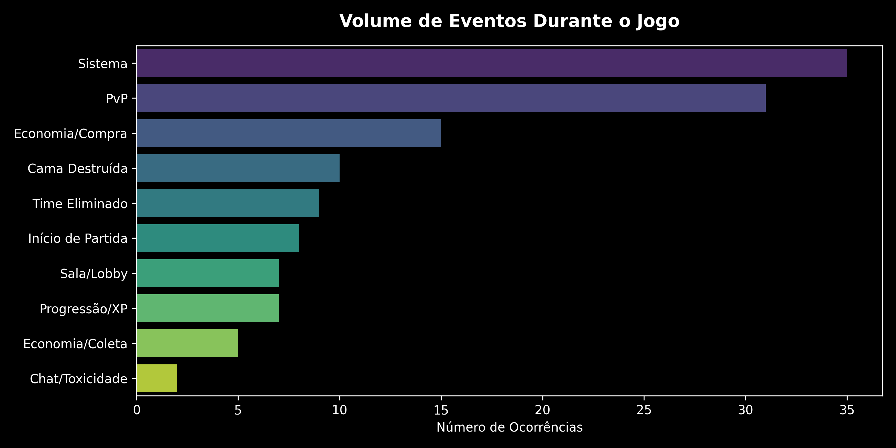
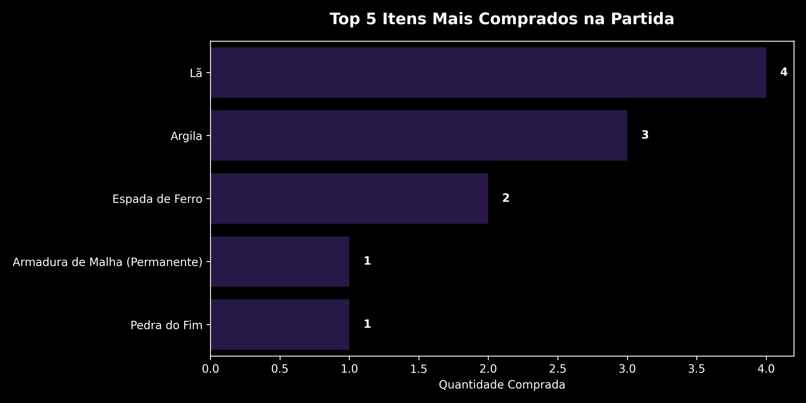
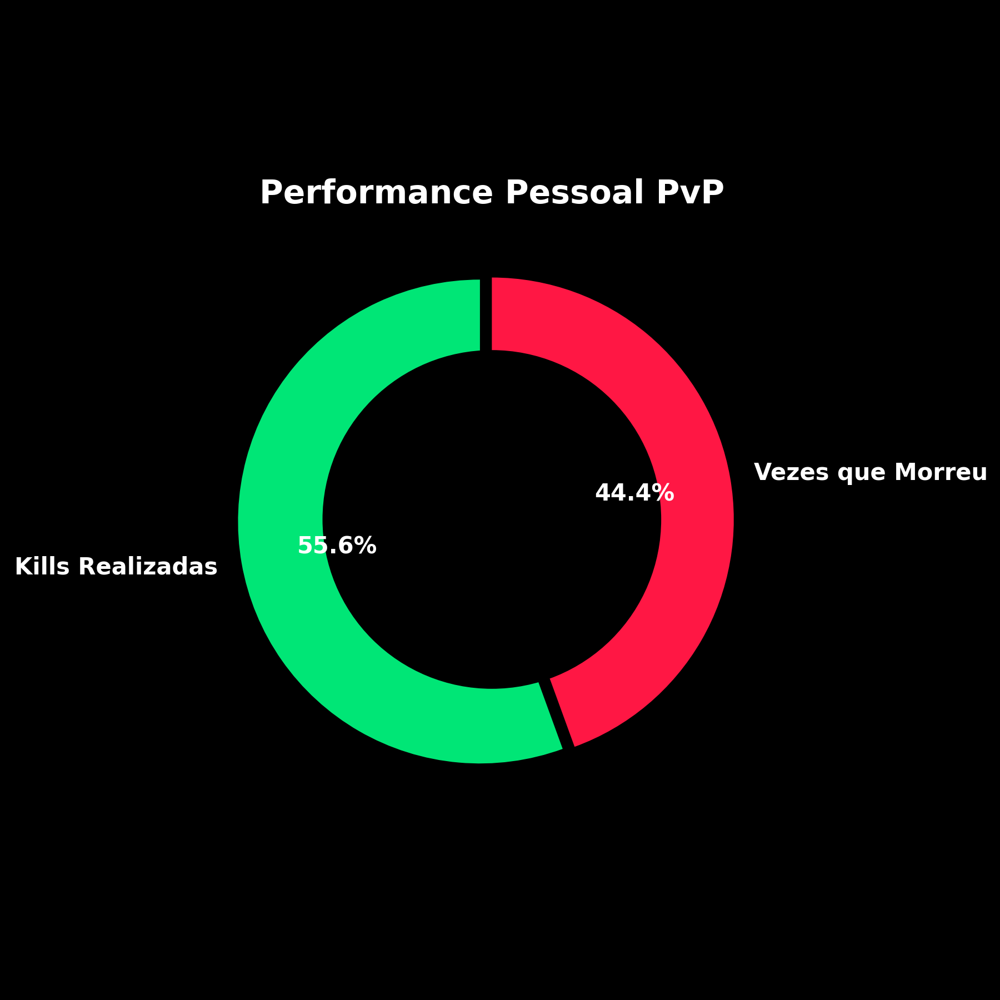

# 🕹️ MushMC BedWars ETL Pipeline

> Pipeline de Engenharia de Dados para transformar logs não estruturados de partidas em tabelas analíticas e visualizações automatizadas.

[](https://www.python.org/)
[](https://spark.apache.org/)
[](https://pandas.pydata.org/)
[](#-arquitetura-do-pipeline)

---

## 📌 Sobre o projeto

Este projeto implementa um pipeline ETL ponta a ponta para processar logs brutos gerados durante partidas de BedWars no servidor MushMC, em Minecraft 1.8.9.

O pipeline normaliza o encoding dos arquivos, identifica eventos por expressões regulares, separa partidas com Window Functions, estrutura os dados com PySpark e gera automaticamente arquivos analíticos e dashboards.

### O pipeline realiza

- leitura e normalização de logs em Windows-1252;
- conversão dos arquivos para UTF-8;
- classificação de eventos com Regex;
- identificação cronológica das partidas;
- extração de jogadores, itens, recursos e objetivos;
- agregações analíticas com PySpark;
- exportação dos resultados em CSV;
- geração automatizada de gráficos em PNG.

---

## 🏗️ Arquitetura do pipeline

```text
latest.log
    │
    ▼
Normalização de encoding
Windows-1252 → UTF-8
    │
    ▼
Ingestão com PySpark
    │
    ▼
Parsing e classificação com Regex
    │
    ▼
Separação de partidas com Window Functions
    │
    ▼
Transformações e agregações analíticas
    │
    ├── Eventos da partida
    ├── Compras e recursos
    ├── Kills e mortes
    └── Camas destruídas
    │
    ▼
Pandas + Matplotlib + Seaborn
    │
    ▼
CSV estruturado + dashboards PNG
```

---

## 📊 Resultados visuais

Os gráficos abaixo são gerados automaticamente a partir dos dados processados pelo pipeline.

### Volume de eventos

<p align="center">
  
</p>

### Compras e desempenho PvP

<p align="center">
  
  
</p>

### Outros resultados gerados

- [jogadores com mais kills](./data/curated/dashboards/03_top_killers.png);
- [camas destruídas por time](./data/curated/dashboards/05_camas_destruidas.png);
- [volume de eventos identificados](./data/curated/dashboards/02_volume_eventos.png);
- [itens mais comprados](./data/curated/dashboards/01_top_itens.png).

---

## 🧠 Desafios de engenharia resolvidos

### Encoding legado

Os logs de origem utilizam Windows-1252, enquanto o Spark espera UTF-8. O pipeline realiza uma etapa de normalização em Python antes da ingestão na JVM, evitando caracteres corrompidos.

### Parsing de dados não estruturados

Expressões regulares identificam e categorizam mensagens de economia, PvP, objetivos e sistema, extraindo os campos necessários para a análise.

### Separação cronológica das partidas

Como um mesmo arquivo pode acumular várias partidas, o pipeline utiliza Window Functions e soma cumulativa para criar o campo `match_id`.

### Compatibilidade com Windows

Para contornar limitações locais relacionadas ao Hadoop e ao `winutils.exe`, a exportação final é realizada com Pandas após o processamento analítico no Spark.

---

## 🧰 Tecnologias utilizadas

`Python` `PySpark` `Apache Spark` `Spark SQL` `Pandas` `Regex` `Matplotlib` `Seaborn`

---

## 📁 Estrutura principal

```text
Mushmc-bedwars-etl/
├── data/
│   ├── raw/
│   │   └── latest.log
│   └── curated/
│       ├── bedwars_analytics.csv
│       └── dashboards/
│           ├── 01_top_itens.png
│           ├── 02_volume_eventos.png
│           ├── 03_top_killers.png
│           ├── 04_performance_pvp.png
│           └── 05_camas_destruidas.png
├── src/
│   └── mushmc_bedwars_etl.py
├── requirements.txt
└── README.md
```

---

## ▶️ Como executar

### 1. Clone o repositório

```bash
git clone https://github.com/Daviramos7/Mushmc-bedwars-etl.git
cd Mushmc-bedwars-etl
```

### 2. Crie um ambiente virtual

```bash
python -m venv .venv
```

No Windows:

```powershell
.\.venv\Scripts\Activate.ps1
```

No Linux ou macOS:

```bash
source .venv/bin/activate
```

### 3. Instale as dependências

```bash
pip install -r requirements.txt
```

### 4. Adicione o arquivo de entrada

Coloque o arquivo `latest.log` em:

```text
data/raw/latest.log
```

### 5. Configure o jogador principal

No arquivo `src/mushmc_bedwars_etl.py`, altere a constante:

```python
JOGADOR_PRINCIPAL = "seu_nick_aqui"
```

### 6. Execute o pipeline

```bash
python src/mushmc_bedwars_etl.py
```

---

## 📦 Saídas geradas

Após a execução, o pipeline produz:

```text
data/curated/
├── bedwars_analytics.csv
└── dashboards/
    ├── 01_top_itens.png
    ├── 02_volume_eventos.png
    ├── 03_top_killers.png
    ├── 04_performance_pvp.png
    └── 05_camas_destruidas.png
```

O arquivo CSV pode ser utilizado em ferramentas como Power BI e Excel, enquanto os gráficos apresentam os principais resultados da execução.

---

## 🔐 Privacidade dos dados

Logs podem conter nomes de jogadores e mensagens registradas durante as partidas. Antes de publicar novos arquivos, revise o conteúdo e evite disponibilizar informações que não sejam necessárias para demonstrar o pipeline.

---

## 📄 Licença

Copyright © 2026 Davi Ramos Ferreira. Todos os direitos reservados.

---

Desenvolvido por [Davi Ramos Ferreira](https://github.com/Daviramos7)
